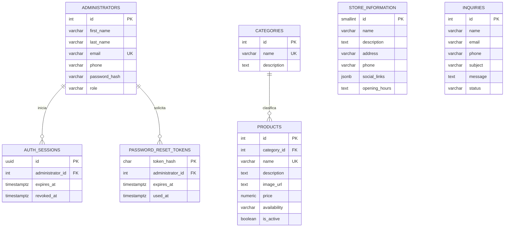

# Modelo de la base de datos

PostgreSQL es la fuente de persistencia. El servidor accede mediante consultas parametrizadas con `pg`; no utiliza ORM.

## Relaciones



`store_information` es una tabla de una sola fila: solamente permite el registro con `id = 1`.

## Integridad

- Los correos de administradores son únicos sin distinguir mayúsculas y minúsculas.
- Los nombres de categorías y productos son únicos sin distinguir mayúsculas y minúsculas.
- Un producto siempre referencia una categoría existente.
- PostgreSQL impide eliminar categorías con productos asociados.
- Los precios no pueden ser negativos.
- La disponibilidad se limita a `in_stock`, `out_of_stock` o `preorder`.
- El estado de una consulta se limita a `pending`, `read` o `answered`.
- Las contraseñas nunca se guardan en texto plano.
- Los tokens de recuperación se guardan mediante un resumen criptográfico SHA-256.
- Cerrar sesión o restablecer la contraseña revoca las sesiones correspondientes.

## Migraciones

Las migraciones se ejecutan en orden y se registran en `schema_migrations`:

1. `001_create_categories.sql`
2. `002_create_authentication.sql`
3. `003_create_store_and_inquiries.sql`
4. `004_create_products.sql`

El ejecutor usa un bloqueo asesor de PostgreSQL para evitar ejecuciones concurrentes.

Para la entrega también se incluye `database/create_database.sql`, un archivo SQL único de creación que incorpora las cuatro migraciones. Debe ejecutarse sobre una base vacía:

```bash
psql "$DATABASE_URL" -f database/create_database.sql
```

## Inspección manual

Con PostgreSQL iniciado mediante Docker:

```bash
docker compose exec postgres psql -U postgres -d gamer_store
```

Comandos útiles dentro de `psql`:

```sql
\dt

SELECT version, applied_at
FROM schema_migrations
ORDER BY version;

SELECT id, first_name, last_name, email, phone, role
FROM administrators
ORDER BY id;

SELECT id, administrator_id, expires_at, revoked_at
FROM auth_sessions
ORDER BY created_at DESC;

SELECT id, name, description
FROM categories
ORDER BY name;

SELECT
  products.id,
  products.name,
  categories.name AS category,
  products.price,
  products.availability,
  products.is_active
FROM products
JOIN categories ON categories.id = products.category_id
ORDER BY products.id;

SELECT * FROM store_information;

SELECT id, name, email, subject, status, created_at
FROM inquiries
ORDER BY created_at DESC;
```

Salir con `\q`.
